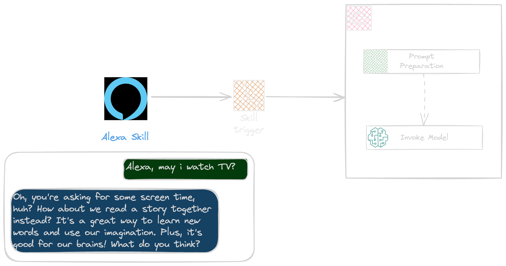

# Integrate Alexa with bedrock

This is an example project demonstrating the integration of Alexa skills with a bedrock backend.



## Setup

To use this repository

- Configure aws account `aws configure`
- Install AWS CDK `npm install -g aws-cdk`
- Create a security profile in the [Amazon developer console](https://developer.amazon.com/loginwithamazon/console/site/lwa/overview.html)
- Instal Alexa Skill kit `npm install -g ask-cli`
- Configure your Alexa account `ask` configure`

## Deploy Backend

> The example use the mistral model which is not available in all regions, please use a region with [mistral available](https://docs.aws.amazon.com/bedrock/latest/userguide/models-regions.html) and make sure you already requested [acess](https://docs.aws.amazon.com/bedrock/latest/userguide/model-access.html) to that model.

To deploy the Backend run the following command

```shell
npm run cdk:app deploy
```

## Deploy Skill

To deploy the skill run the following command to deploy a skill from the manifest provided in the repository

```shell
cd src/skill/WANTIT
ask deploy
```
